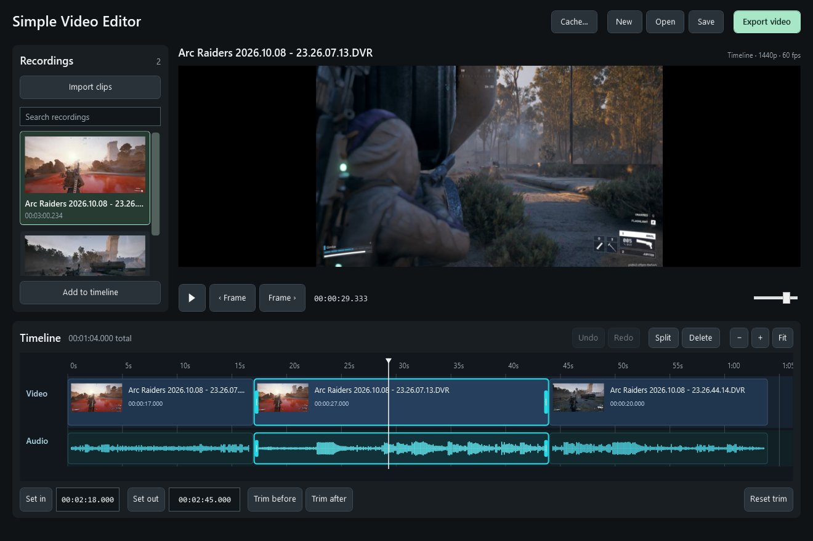

# Simple Video Editor

A portable Windows editor for trimming and combining gameplay recordings. Recordings stay on your PC, and edits leave the original files untouched.



*Arc Raiders gameplay with multiple cuts and linked audio waveforms.*

## Run

[Download the Windows ZIP](https://github.com/Gimbuhh/simple-video-editor/releases/latest/download/SimpleVideoEditor-win-x64.zip), extract it, and open **SimpleVideoEditor.exe**. Keep its files together; the bundle includes the desktop runtime and video tools. No installer, app account, or separate media-tool setup is required. Downloads require access to this private GitHub repository.

In this local project folder, use the **Simple Video Editor** shortcut or `App/SimpleVideoEditor.exe`. A fresh source checkout needs the build commands below first.

## Editing

1. Import recordings, then drag them onto the timeline.
2. Drag clip edges to trim. Move clips freely; nearby edges snap together automatically.
3. Use **Split** to keep multiple moments from one recording. **Trim before** and **Trim after** remove either side of the playhead in one step.
4. Export the combined timeline as an AV1 or H.264 MP4.

Video and audio stay linked. The audio track shows real waveforms, and playback follows cuts and gaps. Projects save the recording library and edits; recovery, missing-file relinking, undo/redo, library search, and cache cleanup are included.

| Shortcut | Action |
| --- | --- |
| Space | Play / pause |
| Ctrl+B | Split at the playhead |
| Q / W | Trim before / after the current frame |
| I / O | Set the selected clip's in / out point |
| Delete | Remove the selected timeline clip |
| Ctrl+Z / Ctrl+Y | Undo / redo |
| Ctrl+I / Ctrl+F | Import / search recordings |
| Ctrl+S | Save project |

See the [user guide](docs/user-guide.md) for all shortcuts, editing behavior, export settings, and recovery details.

## Requirements and scope

- Windows x64. Version 1.0.0.
- SDR video; verified with 1440p/60 fps AV1 Shadowplay recordings. HDR is currently unsupported.
- One video track with linked audio, straight cuts, and the first audio stream. Separate audio editing, effects, titles, and transitions are outside the current scope.
- NVIDIA export is optional; CPU encoding is available. Preview uses software rendering. Shadowplay capture targeting still needs checking while a game is running.

## Development

Run from the repository root in PowerShell:

```powershell
./Development/scripts/setup.ps1
./Development/scripts/check-repository.ps1
./Development/scripts/test.ps1
./Development/scripts/build.ps1 -Zip
```

Setup downloads the pinned, checksum-verified SDK and media dependencies. The default tests use generated recordings and CPU encoding, without NVIDIA hardware. [Development documentation](docs/development.md) covers desktop UI checks and optional NVIDIA/real-recording tests.

| Folder | Purpose |
| --- | --- |
| `Development/src/` | Application source and icon assets |
| `Development/tests/` | Core/media and WPF UI verification |
| `Development/scripts/` | Setup, checks, build, test, and cleanup |
| `docs/` | User, development, and release guides |
| `App/`, `Releases/` | Generated local app and portable ZIP; ignored by Git |

## Releases and project policies

Portable ZIPs belong in GitHub Releases, rather than source history. The [release guide](docs/releasing.md) describes versioning, validation, and the workflow that prepares a draft release.

- [Changelog](CHANGELOG.md)
- [Contributing](CONTRIBUTING.md)
- [Security policy](SECURITY.md)
- [MIT license](LICENSE) and [third-party notices](THIRD-PARTY-NOTICES.md)
