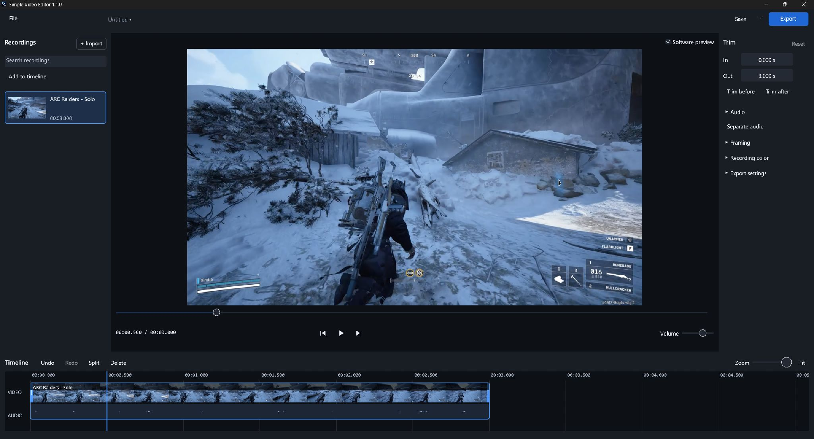

# Simple Video Editor

A portable Windows editor for trimming and combining local recordings. Edits leave the original files untouched.



Version 1.1.0 is the Rust release candidate. It includes responsive native preview, HDR-to-SDR conversion, timeline thumbnails and independent audio editing. The portable app needs no .NET runtime; its compared download is about 25% smaller than 1.0.4. See the [comparison](docs/rust-csharp-comparison.md) for measurements and memory tradeoffs.

The [release checklist](docs/release-readiness.md) records verified software checks and remaining physical acceptance. Version 1.1 is unpublished; keep the published 1.0.x app and original projects for rollback while testing.

## Run

Extract the complete portable ZIP and open **Simple Video Editor.exe**. Keep **bin** and **docs** beside it. The Rust app needs no installer, account, .NET runtime, or separately installed FFmpeg.

[Published Windows releases](https://github.com/Gimbuhh/simple-video-editor/releases) require access to this private repository. Build the candidate from this branch using the commands below.

## Editing

1. Import recordings, select one for preview, and use **Add to timeline**, **Add all**, or drag a recording onto the timeline.
2. Drag linked sections to move them. Drag edges to trim, split at the playhead, or remove sections. Right-click a section and choose **Separate audio** to edit its audio independently; **Link audio** rejoins items with matching trim and position. Gaps and repeated sections are preserved.
3. Expand **Export settings** in the right sidebar to choose size, frame rate, SDR/HDR10 color and codec. Per-section audio stream, gain, mute, fades, fit/fill/crop and rotation are saved with the project.
4. Export an MP4 using NVIDIA encoding when supported, with CPU fallback.

PQ and HLG inputs are supported. HDR-to-SDR conversion uses scene-aware tone and color mapping on compatible Vulkan graphics, with standard CPU conversion otherwise. Preview, thumbnails and exports share that choice. Native HDR presentation is requested only when Windows reports active HDR on the preview display; software preview uses SDR. Physical HDR presentation is not certified by metadata or screenshots.

| Shortcut | Action |
| --- | --- |
| Space / Left / Right | Play or pause / previous or next decoded frame |
| Ctrl+B or S | Split at the playhead |
| Q / W | Trim before / after, retaining the current frame |
| I / O | Set selected section in / out |
| Delete | Delete the selected video/audio item |
| Ctrl+Z / Ctrl+Y | Undo / redo |
| Alt+Left / Alt+Right | Swap neighboring sections |
| Ctrl+I / Ctrl+F | Import / search recordings |
| Ctrl+N / Ctrl+O | New / open project |
| Ctrl+S / Ctrl+Shift+S | Save / save as |
| Shift+F10 | Selected section context menu |

See the [user guide](docs/user-guide.md) for persistence, recovery, source interpretation and export details. Transitions are follow-up work after the rewrite; hard cuts remain the default.

## Development

Run from the repository root in PowerShell:

```powershell
./Development/scripts/setup.ps1
./Development/scripts/check-repository.ps1
./Development/scripts/test.ps1 -Ui -Gpu -Extended
./Development/scripts/build.ps1 -Zip -OutputName App-Updated
./Development/scripts/verify-package.ps1 -OutputName App-Updated -Desktop -Extended
./Development/scripts/test-packaging.ps1
```

Omit `-Gpu` without compatible NVIDIA hardware. Setup restores checksum-pinned workspace-local Rust/LLVM and native media tools. Generated media tests need no private recordings. [Development details](docs/development.md) cover the isolated 1.0.4 oracle and verification limits.

| Folder | Purpose |
| --- | --- |
| `Development/rust/crates/` | Rust application, editor core, media, persistence and Windows boundaries |
| `Development/assets/` | Authored icon and Windows manifest |
| `Development/tests/RustParityOracle/` | Test-only reader of the exact old implementation restored from Git |
| `Development/scripts/` | Setup, checks, build, test and cleanup |
| `App*/`, `Releases/`, `Development/artifacts/` | Ignored generated bundles, packages and verification evidence |

The application version in `Development/rust/crates/desktop-ui/Cargo.toml` owns executable metadata and package names. [Release policy](docs/releasing.md) requires user testing, passing checks, and approval before merge, tagging or publication.

[Changelog](CHANGELOG.md) · [Contributing](CONTRIBUTING.md) · [Security](SECURITY.md) · [License](LICENSE) · [Dependency notices](THIRD-PARTY-NOTICES.md) · [Rewrite evidence](docs/rust-rewrite-status.md)
